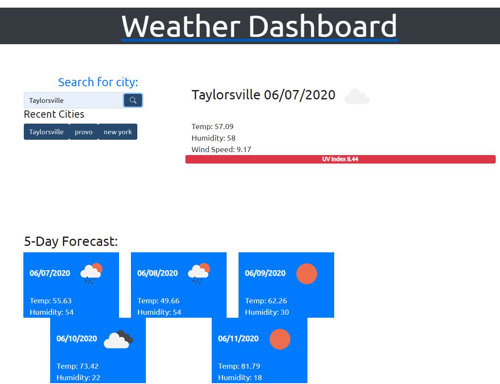

# Week-Six-Challenge-Weather-Dashboard!

Weather Dashboard created by Jeremy C. Collins. This is my week six challenge to make a Weather Dashboard using Server-Side APIs/Jquery/Bootstrap/Moment.js/Javascript. This Weather Dashboard, includes features that allow users to search for any city, and see the current day's weather condition, the current day's UV index value (which is color coded to show favorable/moderate/severe weather conditions), and also a 5 day weather forecast! It will save the city searches to the localStorage, and display the search history as buttons to be searched again.

### Useful links
* This Live Repo: [https://garves44.github.io/w6c-weather-dashboard/](https://garves44.github.io/w6c-weather-dashboard/)
* My Github Portal: [https://garves44.github.io/](https://garves44.github.io/)

## Contact
* Email: **garves44@gmail.com**
* LinkedIn:[https://www.linkedin.com/in/jeremy-collins-209545194/](https://www.linkedin.com/in/jeremy-collins-209545194/) 

